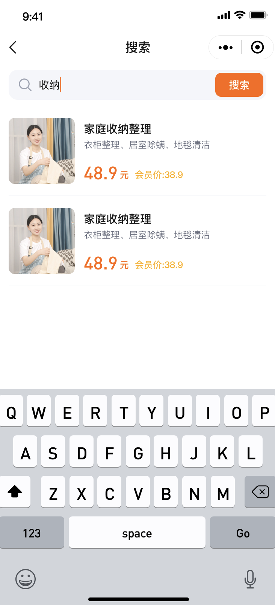

# 闲 D 岛出品 《商务小程序》

## 进军方向

-   [ ] 开源 Java 后端，并将现有的微服务架构改成 boot
-   [ ] 使用 Nestjs 为其打造独立完整的后端服务，
-   [ ] 配套文档

## 战役日志

-   24.3.26
    -   [x] 整理效果图，并开源。✅

## 技术选型

-   React
-   Taro3
-   mobx
-   Ts

## 效果图

| 模块                       | biu                          | biu                             | biu                            |
| -------------------------- | ---------------------------- | ------------------------------- | ------------------------------ |
| 首页                       |   |  |      |
| 详情&分类&购物车           |   |      |   |
| 结算&明细&人员             |   |      |   |
| 结算&明细&人员             |   |      |   |
| 评价&优惠卷&时间           |  |     |  |
| 订单中心&订单详情&会员中心 |  |     |  |
| 个人中心&积分商城&评价     |  |     |  |
| 商户端                     |  |     |  |

## 鸣谢
承蒙深红老师的鼎力相助，为我心中挚友深佬发出由衷感谢。
“You can take the darkness from the pit of the night，and turn it to a beacon burning endlessly bright”

有问题，欢迎来闲 D 岛 🏝️ 咨询

